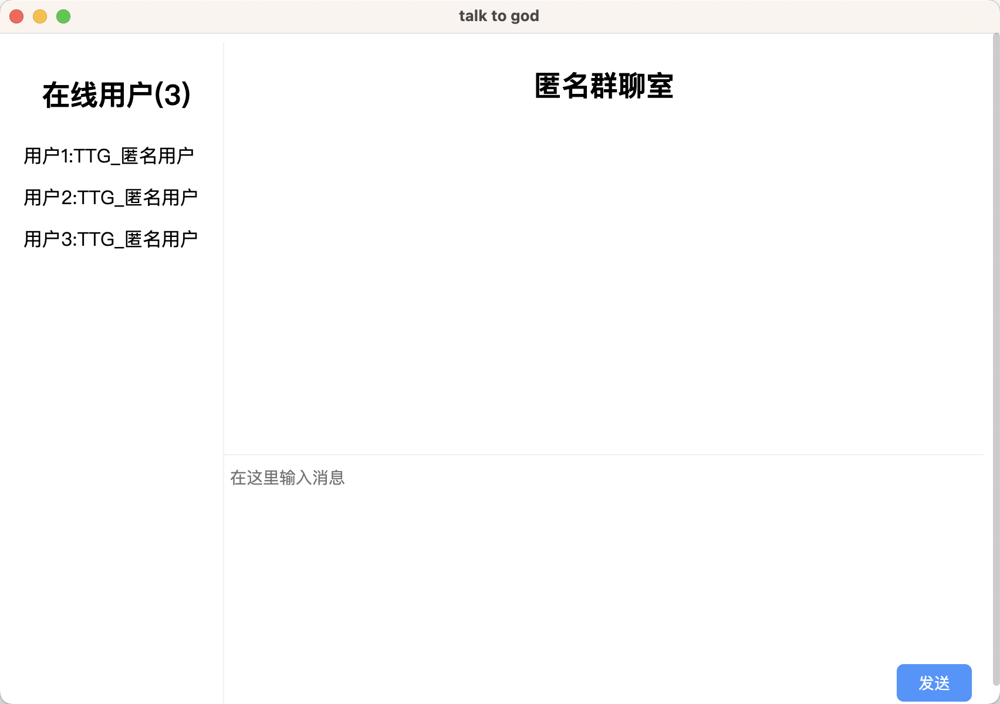

# TalkToGod 聊天室软件

[English](README.md)

🚀🚀🚀 一款干净无存储的跨平台聊天室软件，支持 Windows、Mac、Linux 平台

## Windows

- 可以在 [Github](https://github.com/codingkits/talktogod/releases) 下载`exe`安装包
   

## Linux

- 可以在 [Github](https://github.com/codingkits/talktogod/releases) 下载`AppImage`包，`chmod +x`, 双击运行  
   

## Mac

- 可以在 [Github](https://github.com/codingkits/talktogod/releases) 下载`dmg`安装包
   

## 启动

  

<h6 style="text-align:center">[图 1] 首页</h6>

  

<h6 style="text-align:center">[图 2] 聊天</h6>

## 里程碑

- 2023-08-18: 匿名聊天实现
- 2023-08-11: 构思设计
- 2023-08-10: 项目孵化

## 赞助

- 给我点个 Star⭐

## 贡献者

在这里感谢所有为此项目做出贡献的人.

## License

[MIT](LICENSE)

## Support

[虚位以待](nobody)
