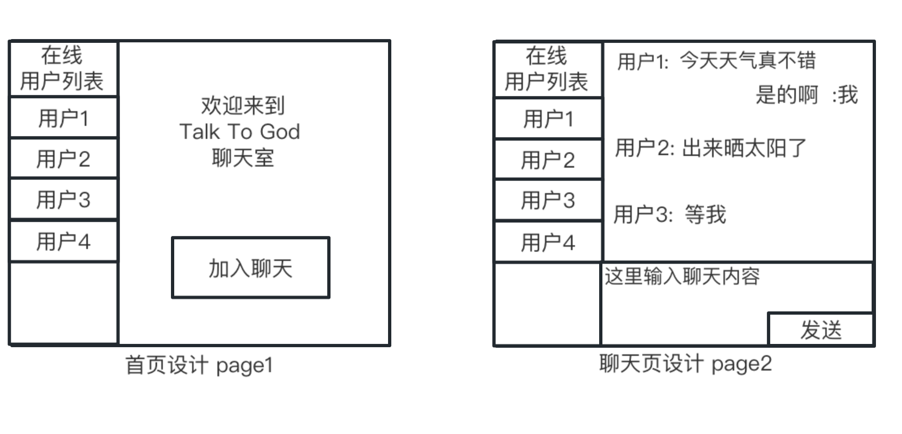

# Talk To God

## 项目介绍

- 【导读】:`TalkToGod 是一款聊天室软件`

## 技术栈

| No  | 服务     | 技术选型           |
| :-: | :------- | :----------------- |
| 01  | 客户端   | Electron           |
| 02  | 后端     | Go                 |
| 03  | 通信协议 | Http WebSocket |
| 04  | 数据存储 | Mysql Redis    |

## 需求说明

### <a>v0.0.1</a>

- 显示连接数
- 输入任意名称即可加入聊天室
- 文字群聊

### 设计 UI

## 技术实现

## 项目贡献

- 维护者: codingkits <d.joeyana@gmail.com>
- 维护者: liuyuanfa <463001681@qq.com>
- 设计日期: 2023 年 8 月 14 日 星期一 10 时 58 分 07 秒 CST
